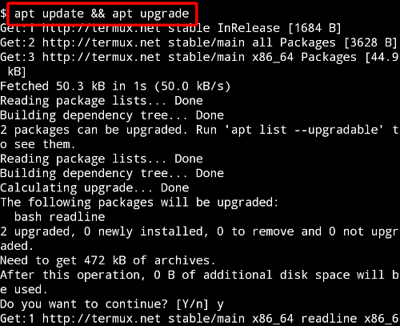
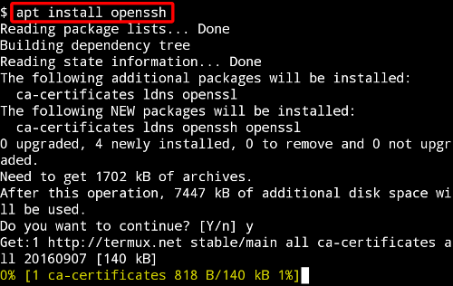
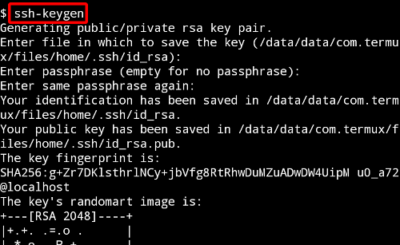
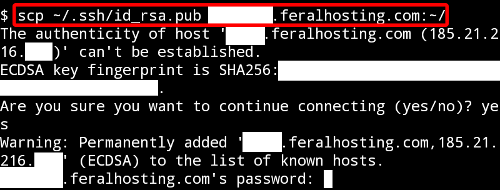
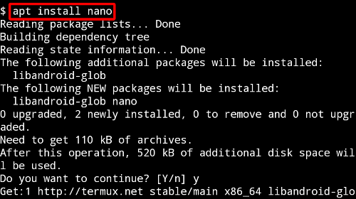
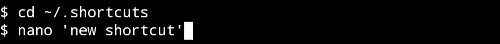
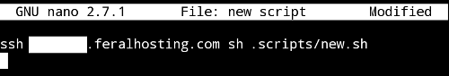

Termux is a terminal emulator and linux environment for Android. Unlike most terminal emulators, Termux allows you to install and update packages from a custom repository and perform many tasks which would otherwise necessitate separate mobile applications. You can edit files with nano and vim, develop in C with clang, make, and gdb, and debug code from the python console. This functionality also includes being able to run bash scripts which can interact with your Feral slot via ssh. With the Termux:Widget add-on, you can execute these shortcuts directly from your homescreen. 

This process should work on any Android 5.0+ device. You do not need to be rooted. Some sections of this guide will overlap with existing material regarding password-less authentication.

Termux and its add-ons are open-source so if you do not want to pay $1.99 to buy the Termux:Widget add-on from Google Play, you can download it at no cost from GitHub or the F-Droid repository.

1. Updating the Termux Environment
---

Once Termux is installed and running, you need to update the local repository catalog and upgrade the packages that were pre-installed with the application. Type `y` and tap the `Enter` key to confirm when prompted.

~~~
apt update && apt upgrade
~~~

2. Installing OpenSSH
---

Next you need to install openssh. Type `y` and tap the `Enter` key to confirm when prompted.

~~~
apt install openssh
~~~

3. Generate a public and private key pair for your Android device
---

Issue this command. When asked where you want to store the keys, just hit the `Enter` key to use the default. Specifying a password is not mandatory.

~~~
ssh-keygen
~~~

4. Send your Android device's public key to server and add to authorized_keys
---

**1.** Use this command to send your new public key to the remote server. Type `yes` and tap the `Enter` key when prompted to accept the host's key. Input your password and tap `Enter` again.

~~~
scp ~/.ssh/id_rsa.pub feralusername@servername.feralhosting.com:~/
~~~

**2.** Login to the remote server:

~~~
ssh feralusername@servername.feralhosting.com
~~~

**3.** Add the key to the authorized_keys list of the server. (Note: If you get the message "No such file or directory", it means that your .ssh directory doesn't exist. Type `mkdir ~/.ssh` and then retry the following command.) 

~~~
cat id_rsa.pub >> ~/.ssh/authorized_keys
~~~

**4.** Remove public key file:

~~~
rm id_rsa.pub
~~~

**5.** Set the correct permissions on the .ssh directory and the authorized_keys file:

~~~
chmod 700 ~/.ssh
chmod 600 ~/.ssh/authorized_keys
~~~

5. Create scripts on server
---

Make a few scripts on your slot to do basic tasks like restarting software. On my slot I created a directory called `.scripts` to store these files. To exit the nano editor, press CTRL + X, type `y` and tap `Enter` to save. On Termux, CTRL is emulated by the `Volume Down` key. 

~~~
mkdir ~/.scripts
nano ~/.scripts/yourscriptname.sh
~~~

Here are some examples of simple bash scripts you can use:

**Restarting rtorrent**

~~~
killall -9 -u $(whoami) rtorrent
sleep 2s
screen -dmS rtorrent rtorrent
~~~

**Restarting deluged**

~~~
killall -9 -u $(whoami) deluged
sleep 2s
deluged
~~~

**Restarting transmission**

~~~
killall -9 -u $(whoami) transmission-daemon
~~~

**Restarting plex**

~~~
pkill -9 -fu "$(whoami)" 'plexmediaserver'
~~~

**Restarting couchpotato**

~~~
kill $(cat ~/.couchpotato/couchpotato.pid)
sleep 10s
python ~/.couchpotato/CouchPotato.py --daemon
~~~

**Restarting sickrage**

~~~
kill "$(pgrep -fu "$(whoami)" "python $HOME/.sickrage/SickBeard.py -d")"
sleep 10s
python ~/.sickrage/SickBeard.py -d --pidfile="$HOME/.sickrage/sickrage.pid"
~~~

**Restarting irssi**

~~~
kill "$(pgrep -fu "$(whoami)" "autodl")"
sleep 10s
screen -dmS autodl irssi
~~~

**Restarting plexrequests**

~~~
kill "$(pgrep -fu "$(whoami)" "meteor --port number")"
sleep 2s
cd ~/.plexrequests && screen -dmS plexrequests meteor --port 30023
~~~

Use your imagination here - any repetitive task you would normally perform via PuTTY/SSH can be scripted. Consult the FAQ to find relevant commands, create scripts for whatever you want to do, then proceed to the next step.

6. Create shortcuts on Termux
---

**1.** Install the nano editor. Type `y` and tap the `Enter` key to confirm when prompted.

~~~
apt install nano
~~~

**2.** Navigate into the .shortcuts directory. You may need to create the directory (`mkdir ~/.shortcuts`) if it is not created when the Termux:Widget add-on is installed.

~~~
cd ~/.shortcuts
~~~

**3.** Create a new file for your shortcut and open it in the nano editor.

~~~
nano 'new shortcut'
~~~

**4.** Tell the shortcut to connect to the remote server and execute the script you created earlier:

~~~
ssh feralusername@servername.feralhosting.com sh .scripts/yourscriptname.sh
~~~

**5.** Now you can place the widget on your homescreen, resize it if necessary, and tap on your shortcut to execute the command. 

Note that whenever changes are made to the .shortcuts directory you will need to tap the refresh button on the widget.

Termux provides users with a very convenient set of tools for which there are a wide range of use cases that you might find interesting, such as running sshd or ftpd servers for wireless shell access or file transfer. Learn more at https://termux.com/help.html

